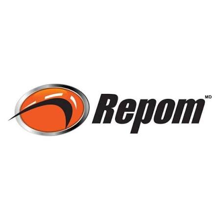

<div align="center">
  

  # LEVO AUTO

  **Automação operacional para vale-pedágio e emissão de CT-e**

  Uma extensão Chrome que transforma XMLs de NF-e em um fluxo integrado entre
  REPOM e Simples CTE, reduzindo tarefas repetitivas e mantendo os dados da
  operação organizados em um único lugar.

  `Chrome` &nbsp; `Manifest V3` &nbsp; `JavaScript` &nbsp; `Automação operacional`
</div>

---

## Visão geral

O LEVO AUTO lê os XMLs de NF-e selecionados pelo usuário, identifica os dados
da viagem e conduz o processo desde a preparação do vale-pedágio até o início
do CT-e.

```text
XMLs de NF-e  ->  validação e agrupamento  ->  REPOM  ->  Simples CTE
```

O projeto também inclui a extensão auxiliar **Busca de Produtores**, usada para
consultar produtores e distâncias a partir da mesma base compartilhada.

## Serviços integrados

<table>
  <tr>
    <td align="center" width="50%">
      <br>
      <strong>REPOM</strong>
    </td>
    <td align="center" width="50%">
      <br>
      <strong>Simples CTE</strong>
    </td>
  </tr>
  <tr>
    <td valign="top">
      No fluxo do LEVO AUTO, o REPOM é responsável pela emissão do
      vale-pedágio. A extensão reutiliza uma aba do sistema, realiza o login de
      acordo com a empresa emissora, preenche a viagem e captura o número do
      pedágio, o meio de pagamento, o valor e a empresa utilizada.
    </td>
    <td valign="top">
      O Simples CTE recebe os dados preparados pela extensão para iniciar a
      emissão do CT-e. O LEVO AUTO seleciona a transportadora, envia as chaves
      das NF-e por grupo de produtor e preenche informações de frete e
      vale-pedágio obtidas durante a operação.
    </td>
  </tr>
</table>

> As marcas REPOM e Simples CTE pertencem aos seus respectivos titulares. Elas
> são exibidas aqui apenas para identificar os sistemas integrados ao projeto.

## Principais recursos

- Leitura de vários XMLs de NF-e em uma única operação.
- Extração de placa, produtor, município, notas, chaves de acesso, peso e valor.
- Validação para impedir a mistura de notas de caminhões diferentes.
- Agrupamento por produtor para evitar CT-e globalizado indevido.
- Cálculo do destino e da distância de pedágio pela nota mais distante.
- Validação da placa na base local de caminhões.
- Login e preenchimento automatizados no REPOM.
- Captura e histórico local dos pedágios emitidos, separados por usuário.
- Preparação do CT-e no Simples CTE por grupo de produtor.
- Preenchimento da calculadora de frete mínimo com os dados da viagem.
- Reutilização das abas dos serviços para manter o fluxo mais organizado.

## Fluxo operacional

1. Abra o LEVO AUTO e entre com seu usuário.
2. Selecione um ou mais XMLs de NF-e.
3. Confira a placa, a cidade, a nota inicial, a quantidade e os grupos de produtores.
4. Para viagens com pedágio, clique em **Fazer REPOM**.
5. Aguarde a emissão e confira os dados capturados no painel da extensão.
6. Clique em **Fazer CTE**.
7. No Simples CTE, revise as chaves e os dados preenchidos para concluir o CT-e.

## Estrutura do projeto

```text
pedagio-auto/
|-- dados-compartilhados/             Base de produtores e quilometragens
|-- extensao-levo-auto/               Extensão principal
|   |-- app/                          Interface local da extensão
|   |-- app/services/                 XML, sessão, storage, dados e lançadores
|   |-- automation/                   Engine e rotinas de automação do REPOM
|   |-- content/repom/                Integração com as páginas do REPOM
|   |-- content/simples-cte/          Integração com o Simples CTE
|   |-- data/                         Caminhões e configurações locais
|   |-- icon/                         Ícones da extensão
|   |-- shared/                       Constantes, formatadores e helpers
|   |-- background.js                 Service worker
|   |-- content.js                    Roteador dos content scripts
|   `-- manifest.json                 Manifest V3
|-- extensão-chrome-integrados/       Busca auxiliar de produtores e KM
|-- img/                              Mascote e logos usadas neste README
`-- README.md
```

## Instalação no Chrome

### 1. Configure os usuários locais

Crie o arquivo `extensao-levo-auto/data/users.json` com base em
`extensao-levo-auto/data/users.example.json` e preencha as credenciais locais.

Exemplo da estrutura:

```json
[
  {
    "nome": "usuario",
    "senha": "senha-da-extensao",
    "login_repom_plusval": "login-repom-plusval",
    "senha_repom_plusval": "senha-repom-plusval",
    "login_repom_pluma": "login-repom-pluma",
    "senha_repom_pluma": "senha-repom-pluma",
    "is_admin": false
  }
]
```

> `users.json` contém credenciais reais e está no `.gitignore`. Nunca envie
> esse arquivo para o repositório.

### 2. Configure a base compartilhada

A fonte oficial de quilometragem das duas extensões é:

```text
dados-compartilhados/produtores-km.json
```

Como a leitura usa uma URL local `file://`, ajuste a constante
`URL_PRODUTORES_COMPARTILHADOS` nestes arquivos:

- `extensao-levo-auto/app/services/data-service.js`
- `extensão-chrome-integrados/popup.js`

Os dois caminhos devem apontar para o mesmo arquivo. Exemplo para um projeto em
`C:\Projetos\pedagio-auto`:

```js
const URL_PRODUTORES_COMPARTILHADOS =
  "file:///C:/Projetos/pedagio-auto/dados-compartilhados/produtores-km.json";
```

Use barras `/`, mantenha `file:///` no início e não use o caminho do Windows
com barras invertidas diretamente no JavaScript.

### 3. Carregue as extensões

1. Acesse `chrome://extensions`.
2. Ative o **Modo do desenvolvedor**.
3. Clique em **Carregar sem compactação**.
4. Selecione a pasta `extensao-levo-auto`.
5. Se usar a busca auxiliar, repita o processo com `extensão-chrome-integrados`.
6. Abra os detalhes de cada extensão e habilite **Permitir acesso a URLs de arquivo**.
7. Recarregue as extensões depois de alterar caminhos, manifests ou arquivos JavaScript.

## Bases locais

| Arquivo | Finalidade | Versionado |
|---|---|:---:|
| `extensao-levo-auto/data/caminhoes.json` | Placas, motoristas e transportadoras | Sim |
| `dados-compartilhados/produtores-km.json` | Produtores e distâncias compartilhados | Sim |
| `extensao-levo-auto/data/users.example.json` | Modelo da configuração de usuários | Sim |
| `extensao-levo-auto/data/users.json` | Usuários e credenciais reais | Não |

## Checklist de configuração

- [ ] O arquivo `dados-compartilhados/produtores-km.json` existe.
- [ ] As duas constantes apontam para a mesma URL `file:///`.
- [ ] O arquivo local `extensao-levo-auto/data/users.json` foi criado.
- [ ] O acesso a URLs de arquivo está habilitado nas duas extensões.
- [ ] Cada extensão foi carregada a partir de sua própria pasta.
- [ ] As extensões foram recarregadas depois das configurações.

## Observações importantes

- A distância usada no pagamento e no pedágio corresponde ao trajeto de ida.
- Notas de produtores diferentes são separadas em grupos antes do envio ao Simples CTE.
- A importação é bloqueada quando os XMLs selecionados possuem placas diferentes.
- O histórico de pedágios fica no `chrome.storage.local`, separado por usuário.
- A automação depende da estrutura atual das páginas do REPOM e do Simples CTE.
  Alterações nesses sistemas podem exigir a atualização dos seletores.
- Revise os dados preenchidos antes de concluir qualquer emissão nos serviços integrados.

## Validação local

Para verificar a sintaxe de todos os scripts JavaScript da extensão principal:

```powershell
Get-ChildItem -Path "extensao-levo-auto" -Recurse -Filter *.js | ForEach-Object {
  node --check $_.FullName
  if ($LASTEXITCODE -ne 0) { exit $LASTEXITCODE }
}
```

---

<div align="center">
  <br>
  <strong>LEVO AUTO</strong><br>
  Menos repetição no processo. Mais foco na operação.
</div>
